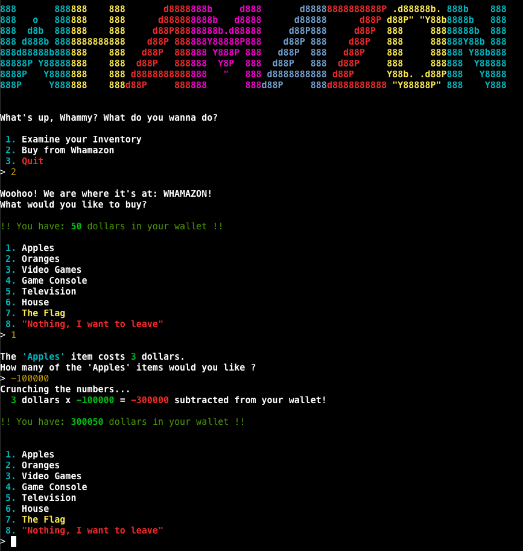
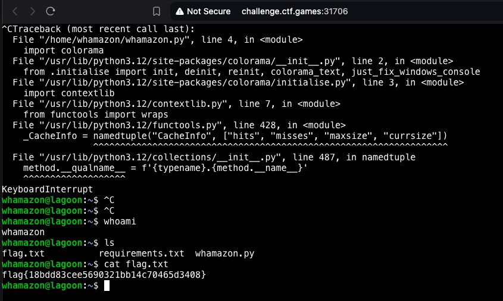

## Description
Author: @JohnHammond

Wham! Bam! Amazon is entering the hacking business! Can you buy a flag?

## Solution
In this challenge, we're presented with a web application that can be accessed through our internet browser. Upon exploring the webapp, we find two major functionalities - viewing our empty inventory and purchasing items. Among the items for sale are some intriguing items like apples and, notably, the flag we're after. Unfortunately, the flag carries quite a hefty price tag, and we only start with a $50 budget with no option to sell items back.

Intercepting the webapp's request traffic with Burp, we observe the use of a websocket. The intercepted traffic consists mainly of incomprehensible text and a few integers, likely encrypted. Modifying these integers and resending the request results in the disconnection of our websocket session.

As there appears to be no direct means of manipulating an item's price, our next strategy involves attempting to buy a negative quantity of apples - and voila! 
This little trick adds the cost of these negative apples to our balance. 
 

After managing to afford and purchase the flag, we are led into a game of rock-paper-scissors against a Whamazon bot. Interestingly, the bot seems to consistently choose the same move, allowing us to finally claim our flag listed in the inventory. 

```
We got all the deets on what's what in your inventory:
 ------------------------ 
  -43786587345 x Apples: A shiny red apple. Probably very tasty: but not all that useful!
  1 x The Flag: A flag you can submit for points in a CTF! It says: flag{18bdd83cee5690321bb14c70465d3408}
```

Flag: `{18bdd83cee5690321bb14c70465d3408}`

### Alternative Solution
Interestingly, an alternate solution exists for obtaining the flag. We can cause a crash in the Python application that's behind the scenes of the webshop, which would subsequently allow us to gain an interactive shell within the associated Docker container.

This can be achieved by repeatedly interrupting the program using the `CTRL-C` command and refreshing the page every time the connection is severed. After several attempts, a stacktrace becomes visible, and normal OS commands can be run inside the shell.
 

---
**Dombusters**: _Writeup written by Sir_X_
